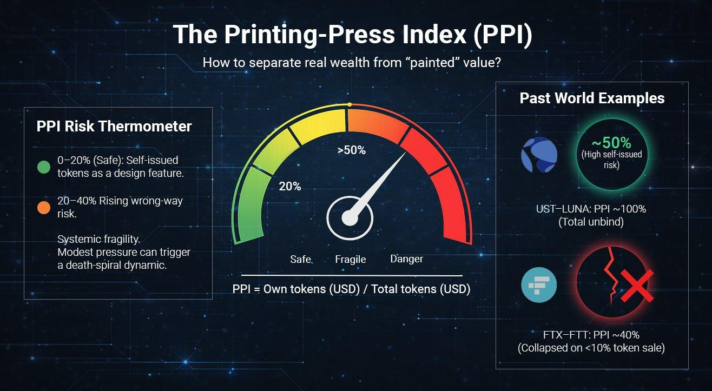
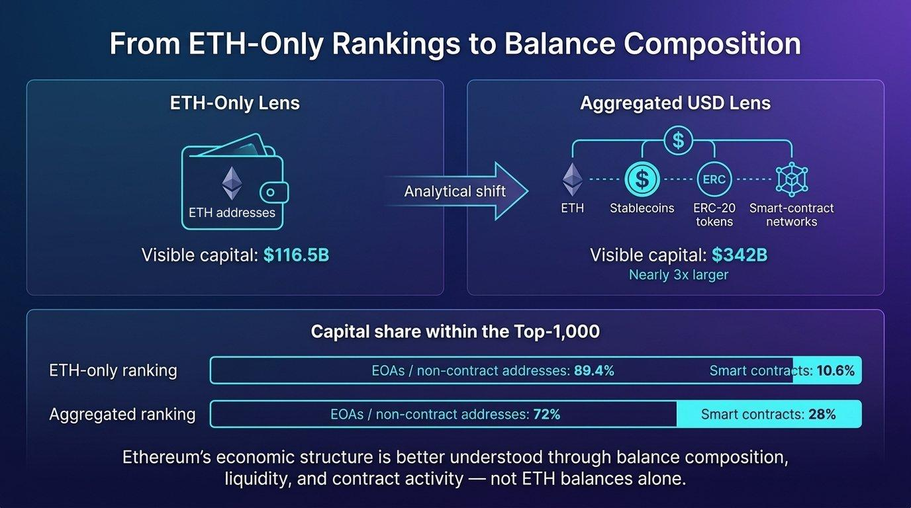

+++
source_id = "ethplorer.article.beincrypto-interview-ethereum-rich-list-altseason"
title = "BeInCrypto Interview - Ethereum Rich List by Aggregated USD Holdings. Mathematically proven - Altseason Already Happened"
source_type = "ethplorer_article"
products = ["ethplorer", "ethplorer_aggregated_rich_list"]
networks = ["ethereum"]
approved_provenance = "User-provided DOCX import: BeInCrypto Interview - Ethereum Rich List by Aggregated USD Holdings. Mathematically proven-Altseason Already Happened.docx"
source_file_sha256 = "1c16774f31d53739f2f9e5e79ce2b96b6a98a7657ca8b79797d5d94f39b66cc2"
review_status = "reviewed"
confirms = ["This approved interview brief explains Ethplorer's Aggregated Rich List, its ETH-plus-token balance-composition lens, and the stated treatment of Beacon and token contracts.", "It documents historical uses of address activity, holder age, smart-contract share, liquidity filters, and the Printing-Press Index."]
limitations = ["This is an interview preparation brief without a canonical public article URL recorded in this repository.", "All values, dates, project examples, rankings, PPI levels, and market narratives are historical; the source does not establish current analytics or investment conclusions."]
+++

# BeInCrypto Interview - Ethereum Rich List by Aggregated USD Holdings. Mathematically proven - Altseason Already Happened

* A document with all the necessary insights on the topic for the interview

Ethplorer.io has created a new Rating System [Aggregated Ranking of Ethereum addresses](https://ethplorer.io/rich-list). This article uses an [aggregated ranking of Ethereum addresses](https://ethplorer.io/rich-list) based on totalBalanceUsd, which includes ETH, ERC-20 tokens and stablecoins valued in USD. This ranking departs from existing approaches, which have traditionally sorted addresses by ethBalanceUsd.

## The main thing that the new rating showed

If you look only at ETH balances, you are effectively blind to most of Ethereum’s real wealth.

Once we rebuilt the rich list by total USD value (ETH + all ERC-20s + stablecoins), the entire picture flipped:

- $342B vs $116.5B - the same Top-10,000 addresses show almost 3× more capital once tokens and stablecoins are counted
- Among the Top-1000, slightly more than half of the addresses overlap (507). 493 exist only in the ETH-Top, while 493 appear only in the Aggregated-Top

- Even more important: 66% of top-holder capital sits outside ETH.
- The altseason did not disappear - it changed form.

- Stablecoins quietly make up ≈ 26% of major balances - a quarter of the real economy
- In the ETH-Top about one-third of wallets are over five years old. In the Aggregated ranking almost 60% are under two years old.
- Smart contracts jump from 10.6% (ETH-Rank) to almost a third of the capital in the Aggregated Top-1000
- Addresses in the aggregated ranking are about 25% more active than those in the ETH-only ranking, with nearly 2× larger balance changes
- The top 5% of addresses drive extreme volatility
- PPI (Printing-Press Index) reveals who holds real value and who sits on self-minted tokens

## Beacon contract

It's important to note that the Beacon contract (0x000...705Fa), which holds approximately 81.2M ETH, appears in traditional rankings as the largest address, accounting for 67.3% (!) of the entire ETH supply - but this is a misrepresentation!

In reality, this contract is a technical deposit log with no withdrawal function. It serves as a record of staking deposits, not a balance controlled by a single entity. The ETH “held” there cannot be withdrawn from that address.

The larger figure (≈81.2M ETH) reflects cumulative deposits into the Beacon contract over time.

For reference, active staking is ≈37.5M ETH (~$71.7B) - a consensus-layer aggregate representing the current net amount of ETH participating in staking after accounting for withdrawals.

In the aggregated Top, the “Beacon” staking occupies less than 10% of the entire Ethereum market.

## Altseason Already Happened - Just Not on the Price Charts

Crypto markets have moved beyond price discovery and into a phase of power discovery. Prices, market caps and TVL are transparent, but it remains unclear who actually controls liquidity, issuance and systemic risk across Ethereum’s on-chain economy.

In earlier cycles, this distinction mattered less. Through most of 2017–2021, ETH represented the majority of Ethereum’s economic value, while tokens and stablecoins played secondary roles. ETH price and market cap were often sufficient proxies for economic influence.

That structure has since changed. By 2022–2023, token-denominated balances reached ETH in economic weight.

In Ethereum’s Aggregated Rating 2026, ETH no longer dominates portfolios.

The Top-10,000 addresses hold about $342B in total value at the end of March 26. Of this amount, $116.5B is held in ETH - roughly 34% - while the remaining ~66% is denominated in tokens. Stablecoins alone account for around 26% of the average large-address balance.

> In that sense, a form of “alt-season” may have already occurred - just not in the way markets traditionally expect. Dominance did not arrive through broad price appreciation or new all-time highs, but quietly, through balance-sheet accumulation.
> This disconnect helps explain why the shift went largely unnoticed. Market participants were watching charts, while structural dominance was changing on-chain.
> What this reveals is not a failed altseason, but a transformed one.

Capital did not rotate into altcoins through explosive price appreciation. Instead, it expanded laterally - across a growing number of protocols, tokens and smart contracts - while prices remained largely range-bound.

For investors, the implication is practical rather than theoretical. In a token-heavy, sideways market, strategies centered on capital preservation and yield capture - staking, liquid staking, restaking and stablecoin-based returns - appear more consistent with how large holders are actually positioning on-chain than speculative bets on illiquid tokens or leveraged exposure.

In other words, structural change is already reflected in balances, while expectations continue to follow charts. If tokens now represent the majority of Ethereum’s economic weight, the more important question is no longer whether this shift exists, but what risks it introduces - especially when a growing share of that capital is self-issued.

## The Printing-Press Index: Measuring Self-Minted Wealth

To separate real capital from self-minted tokens, will be used PPI (Printing-Press Index): PPI = Own tokens (USD) / Total tokens (USD) - the share of a project’s own tokens in its portfolio.

DeFi shows ~2.1× higher mean PPI than CEX (14.7% vs 6.9%), indicating greater reliance on self-issued tokens.

Bridge/L2 is even higher at 34.8% PPI - 2.4× above DeFi and ~5× above CEX - which is partly structural, as bridges require liquidity providers to stake native tokens. However, this does not reduce risk, but shifts it to dependence on token price.

Also, about a quarter of DeFi addresses have PPI >50% (vs just over 10% in CEX), while over half of Bridge/L2 addresses exceed 75% PPI.

Addresses That Would Enter Top-100 If Own Tokens Were Included

Aggregated Ranking in Ethplorer applies a liquidity filter designed to prevent artificial inflation of rankings through self-issued tokens. While these balances may appear very large in USD terms, they are rarely liquid at the quoted market price.

To avoid overstating real economic power, Ethplorer excludes balances that exceed what could realistically be sold during a short period of market liquidity.

The rank reconstruction reveals how dramatically self-issued tokens can distort the perceived economic weight of some addresses. The most extreme case is a Gnosis address (0x849d…039d), which would jump from rank 2,550 to rank 704, a shift of 1,846 positions if the filtered tokens were counted. At the same time, the most striking pseudo-surge occurs with Bitfinex (0xc61b…193c): without the filter, this address would leap from rank 97 to rank 4, effectively appearing as one of the top five richest addresses on Ethereum.

As Ethereum’s economy shifts toward tokens, balance size becomes a weaker indicator of risk. High PPI introduces a well-documented structural risk known as wrong-way risk - where a system’s stability depends on the value of its own token.

At low levels (roughly 10-20%), self-issued tokens function as a design feature. Beyond ~40-50%, the system enters a fragile regime: modest external pressure can impair confidence, compress liquidity, and trigger reflexive sell-offs characteristic of a death-spiral dynamic. At this point, PPI shifts from a descriptive metric to a signal of systemic vulnerability.

The UST-LUNA collapse represents the extreme case. UST was effectively backed by LUNA itself, resulting in a PPI near 100%. When several billion dollars exited the system and the peg weakened, the protocol attempted to restore balance through additional LUNA issuance. This rapidly diluted supply, collapsed price, erased backing, and led to a full unwind within days - a textbook death spiral.

The FTX-FTT case shows that even non-extreme PPI levels can be destabilizing. Leaked balance sheets suggested that roughly 40% of Alameda Research’s assets were denominated in FTT. The collapse was triggered not by mass liquidation, but by Binance’s announcement to sell ~$550M of FTT - less than 10% of the token volume recorded on Alameda’s balance sheet. In conditions of thin liquidity and declining confidence, this was sufficient to trigger a rapid price collapse, a bank run, and systemic failure.

## Conclusion

In a token-heavy market, what matters is no longer how big a balance is, but what it consists of. PPI provides a practical filter for assessing balance-sheet quality, separating externally sourced capital from value amplified through self-issuance. As structural dominance shifts and prices become range-bound, the market focus shifts from chasing “gems” to managing risk. For analysts and investors, monitoring how capital is composed - rather than how fast it grows - becomes central to evaluating resilience, concentration, and risk.

## Smart Contracts vs. HODLers - Are the biggest whales partly code?

Smart contracts become significantly more visible once the ranking is rebuilt by total USD value. In the Aggregated Top-1000, there are 2.7x more contracts than in the ETH-only list (267 vs 99), and they represent roughly 28% of total capital - compared to 10.6% under an ETH-based view.

In other words: The ETH top represents accumulation, while the Aggregated top represents the "living code" - DeFi, bridges, and pools where funds flow. In Ethereum, capital is managed not only by people, but also by code - thus realizing Vitalik Buterin's original vision “Ethereum: The Ultimate Smart Contract and Decentralized Application Platform” (2013 whitepaper).

## The Beating Heart of Ethereum: Where Volatility Lives

Ethplorer compared weekly activity and balance changes across Aggregated ranking and ETH-only to identify where active capital concentrates. Aggregated addresses are consistently more active, especially near the top.

- Activity: 67% of Aggregated addresses transact weekly vs 53% in the ETH Top
- Weekly balance changes: median $26.1M vs $14.2M (≈1.84×)
- More active addresses are also more likely to hold stablecoins (correlation ≈ +0.4)

In October–November 2025, Aggregated addresses showed 3-4× higher volatility (11.5% vs 2.7%), reflecting active altcoin rotation within token-heavy portfolios.

Today, median weekly volatility is similar across rankings (~7%).

The divergence now sits in the head: in the Top-100, the 95th percentile reaches ~25% in Aggregated vs ~11% in ETH-only. These extreme moves 5% cluster in large exchange and liquidity-hub wallets - where ETH is converted into stablecoins and redistributed.

This aligns with the broader capital shift: in late 2025 Aggregated totals exceeded ETH-only by 2.2× ($426B vs $189B); today the gap approaches 3×. Pure ETH exposure continues to decline relative to token and stablecoin balances, indicating structural capital redistribution rather than short-term trading noise.

## Age Shift: Old Whales vs. New Forces

A comparison of the 10,000 largest addresses reveals a clear generational shift.

In the ETH-Top about one-third of wallets are over five years old. In the Aggregated ranking, only 17% exceed that age, while almost 60% are under two years old.

Median first-transaction dates confirm the shift: September 2024 (Aggregated) vs April 2023 (ETH) ~17 months younger.

## Final Insight: The Real Map of Ethereum Power

Ethereum’s on-chain data no longer supports analysis based on ETH balances alone. Once capital is viewed in aggregated USD terms, a different market structure emerges - one that materially changes how dominance and risk should be interpreted:

- $342B vs $116.5B - the same Top-10,000 addresses show almost 3× more capital once tokens and stablecoins are counted
- Stablecoins now account for ~26% of major balances and define day-to-day liquidity
- The median Aggregated-Top address is nearly 1.5 years younger than its ETH-Top counterpart, showing that new capital enters primarily through token and DeFi ecosystems
- 66% of top-holder capital sits outside ETH
- What appears as two-thirds of Ethereum’s supply is actually a cumulative deposit log - in The Aggregated Rank, Beacon staking account for less than 10% of Ethereum's network capital.
- The altseason did not disappear - it changed form. Capital expanded across protocols and balance sheets rather than through price appreciation, explaining why structural dominance shifted without new All-Time Highs.
- Balance size is no longer a proxy for resilience. High PPI levels show that large balances can be internally reinforced by self-issued tokens, creating wrong-way risk even in systems that appear well-capitalized.
- Exposure analysis must shift from narratives to balance composition. Evaluating protocols now requires inspecting aggregated balances, address attribution and self-issued exposure - not just TVL, token price or brand perception.
- Smart contracts have become capital actors. In the Aggregated Top-1,000, contracts are 2.7× more numerous than in the ETH-only list and represent roughly 28% of total capital. Ethereum’s largest holders are no longer just people - they are more and more systems.
- Capital flows are highly concentrated. The top 5% of addresses drive the largest balance movements and volatility spikes, primarily within exchange and liquidity-hub wallets.

> The Ethereum rich list is no longer a ranking of wealth - it is a map of capital flows and embedded risk.
