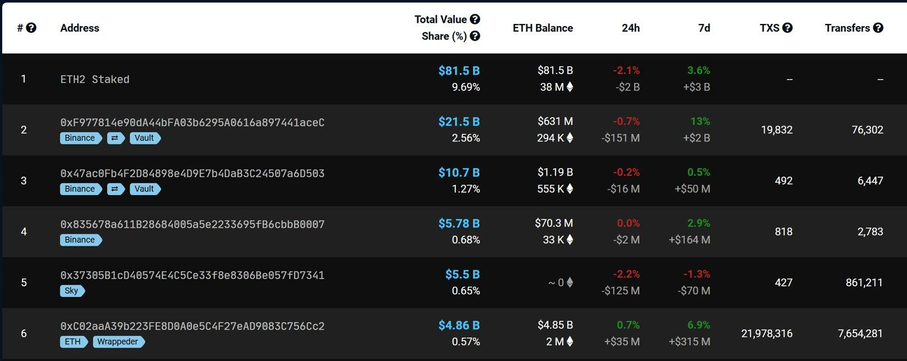
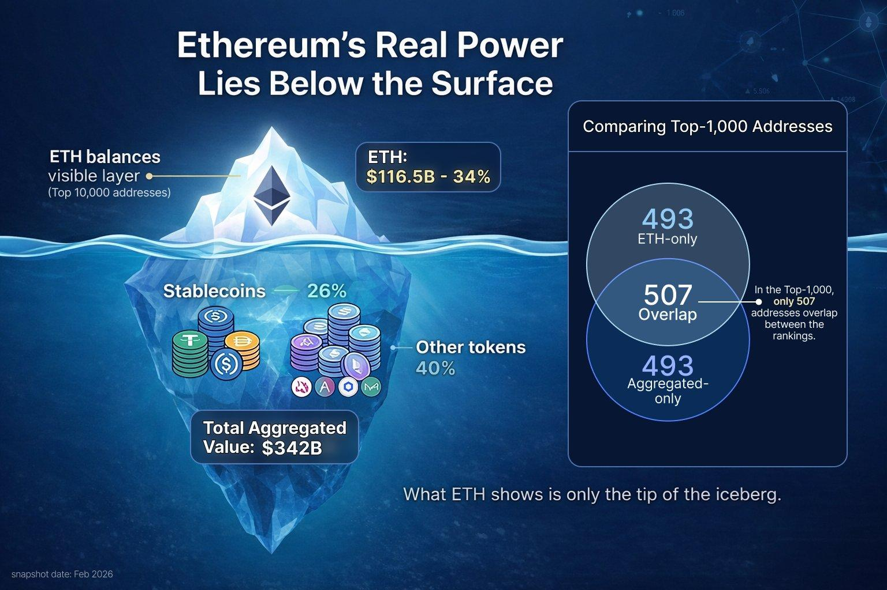
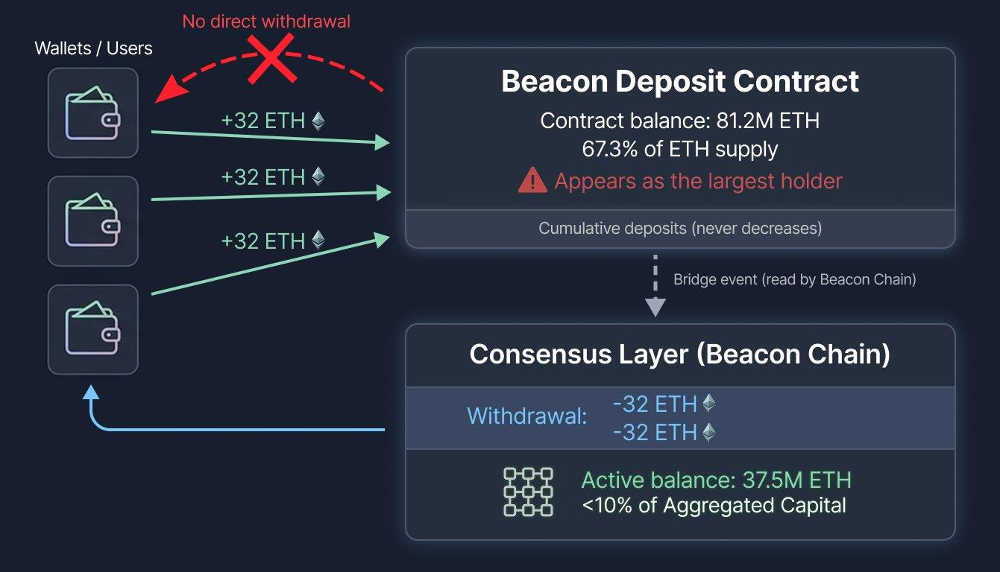
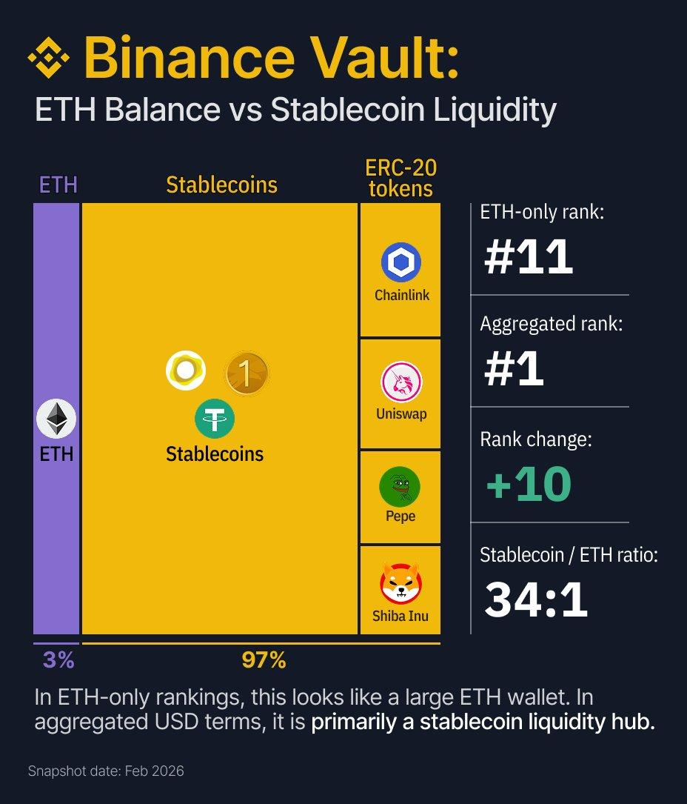
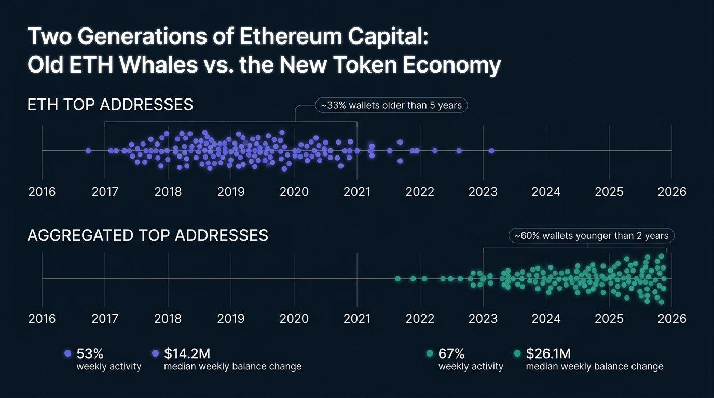

+++
source_id = "ethplorer.article.cryptodaily-ethereum-rich-list-part-1"
title = "CryptoDaily Part 1 - The Real Top You’ve Never Seen: Inside Ethereum Rich List by Aggregated USD Holdings"
source_type = "ethplorer_article"
products = ["ethplorer", "ethplorer_aggregated_rich_list"]
networks = ["ethereum"]
approved_provenance = "User-provided DOCX import: CryptoDaily Part 1 - The Real Top You’ve Never Seen_ Inside Ethereum Rich List by Aggregated USD Holdings.docx"
source_file_sha256 = "800a812554c0649f4cbdad7e4a1f8cd592afbd092e0416adef1290fc676936d8"
review_status = "reviewed"
confirms = ["This approved CryptoDaily brief describes Ethplorer's Aggregated Rich List methodology using totalBalanceUsd across ETH, ERC-20 tokens, and stablecoins.", "It provides a historical balance-composition, address-overlap, holder-age, stablecoin, and tagged-entity analysis with supporting images."]
limitations = ["The brief is an approved derivative editorial source without a canonical Ethplorer article URL in this repository.", "All balances, percentages, rankings, dates, and conclusions are historical snapshot findings and must not be treated as current numerical evidence."]
+++

# CryptoDaily Part 1 - The Real Top You’ve Never Seen: Inside Ethereum Rich List by Aggregated USD Holdings

This is Part 1 of a two-part analysis. Here we focus on where capital sits across Ethereum. In Part 2, we examine how it moves.

## About This Report

This report uses an [Aggregated Ranking of Ethereum addresses](https://ethplorer.io/rich-list) based on totalBalanceUsd, which includes ETH, ERC-20 tokens and stablecoins valued in USD. This ranking departs from existing approaches, which have traditionally sorted addresses by ethBalanceUsd.

The Beacon deposit contract is excluded because it is a technical registry, not a wallet. Below is an explanation of why this decision was made.

Token contracts are also excluded to focus on economically meaningful holders.

## The main thing that the new rating showed

If you look only at ETH balances, you are effectively blind to most of Ethereum’s real wealth.

Once we rebuilt the rich list by total USD value (ETH + all ERC-20s + stablecoins), the entire picture flipped:

- $342B vs $116.5B - the same Top-10,000 addresses show almost 3× more capital once tokens and stablecoins are counted
- Among the Top-1000, slightly more than half of the addresses overlap (507). 493 exist only in the ETH-Top, while 493 appear only in the Aggregated-Top

- Even more important: 66% of top-holder capital sits outside ETH.
- Stablecoins quietly make up ≈ 26% of major balances - a quarter of the real economy
- In the ETH-Top about one-third of wallets are over five years old. In the Aggregated ranking almost 60% are under two years old.

It's important to note that the Beacon contract (0x000...705Fa), which holds approximately 81.2M ETH, is excluded from these calculations. In traditional rankings, it often appears as the largest address, accounting for 67.3% (!) of the entire ETH supply - but this is a misrepresentation!

In reality, this contract is a technical deposit log with no withdrawal function. It serves as a record of staking deposits, not a balance controlled by a single entity. The ETH “held” there cannot be withdrawn from that address.

The larger figure (≈81.2M ETH) reflects cumulative deposits into the Beacon contract over time.

For reference, active staking is ≈37.5M ETH (~$71.7B) - a consensus-layer aggregate representing the current net amount of ETH participating in staking after accounting for withdrawals.

In the aggregated Top, the “Beacon” staking occupies less than 10% of the entire Ethereum market.

The [Binance Vault (0xF977…aceC)](https://ethplorer.io/address/0xf977814e90da44bfa03b6295a0616a897441acec) - ranked 1st in the Aggregated Rank (and 11th in ETH-only) - clearly illustrates the scale of difference between the two approaches.

It holds about $0.68B in ETH, but over $23B in stablecoins and ERC-20 tokens.

The token portion outweighs the ETH balance by roughly 34 to 1.

In the ETH-based ranking, this address appears as a large ETH holder.

But the Aggregated view reveals it as the single largest concentration of dollar-denominated liquidity in Ethereum.

More striking examples of “new whales”:

- Rank 1: +10 positions, +$23B (+3400%) - Binance Vault (0xf977...acec)
- Rank 2: +4 positions, +$9.5B (+820%) - [Binance Vault (0x47ac...d503)](https://ethplorer.io/address/0x47ac0fb4f2d84898e4d9e7b4dab3c24507a6d503)
- Rank 4: NEW (+24,150 positions), +$4.5B - [proxy contract (0x6c96...1dee)](https://ethplorer.io/address/0x6c96de32cea08842dcc4058c14d3aaad7fa41dee) with USDT0

Around 96.4% of addresses in TOP-1000 shift more than 50 positions when moving from the ETH-based to the Aggregated List. Even at a glance, it’s clear that we’re looking at two completely different universes.

Traditional ETH-based rankings miss around 60-70% of the value, which is concentrated in stablecoins and DeFi tokens.

## Age Shift: Old Whales vs. New Forces

A comparison of the 10,000 largest addresses reveals a clear generational shift.

In the ETH-Top about one-third of wallets are over five years old. In the Aggregated ranking, only 17% exceed that age, while almost 60% are under two years old.

Median first-transaction dates confirm the shift: September 2024 (Aggregated) vs April 2023 (ETH) ~17 months younger.

## Stablecoins Shape Ethereum’s Liquidity

Stablecoins now sit at the core of Ethereum’s circulation.

By category, stablecoins dominate CEX portfolios (34%), remain moderate in Other (20%) and Bridges (6%), and are negligible in DeFi.

More active addresses are also more likely to hold stablecoins (correlation ≈ +0.4). Overall, they make up ≈ 26% of large portfolios.

Stablecoins function as Ethereum’s working capital - powering settlement and liquidity, not long-term storage.

## Final Insight: The Real Map of Ethereum Power

Ethereum’s on-chain data no longer supports analysis based on ETH balances alone. Once capital is viewed in aggregated USD terms, a different market structure emerges - one that materially changes how dominance and risk should be interpreted:

- $342B vs $116.5B - the same Top-10,000 addresses show almost 3× more capital once tokens and stablecoins are counted
- Stablecoins now account for ~26% of major balances and define day-to-day liquidity
- The median Aggregated-Top address is nearly 1.5 years younger than its ETH-Top counterpart, showing that new capital enters primarily through token and DeFi ecosystems
- 66% of top-holder capital sits outside ETH
- What appears as two-thirds of Ethereum’s supply is actually a cumulative deposit log - in The Aggregated Rank, Beacon staking account for less than 10% of Ethereum's network capital.

In Part 2, we move from where capital sits to how it moves - and why the next phase of analysis is no longer about size, but about structure and behavior…
