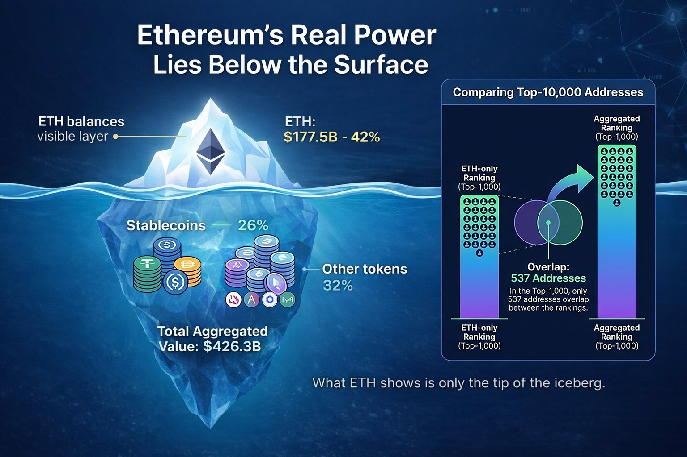
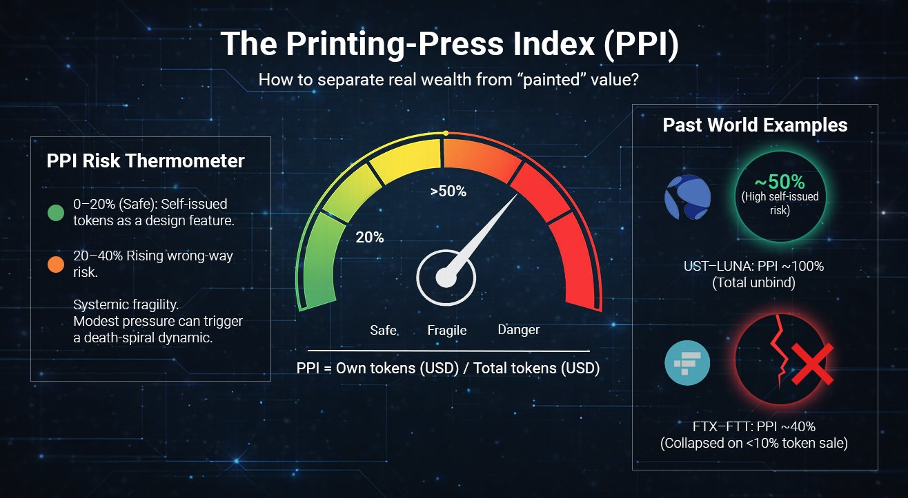
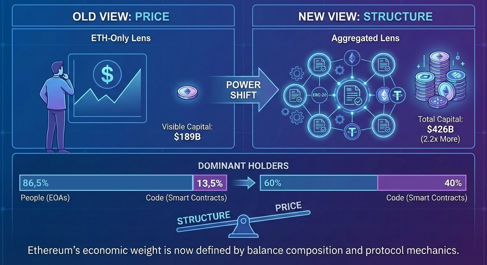

+++
source_id = "ethplorer.article.ethereum-capital-outside-eth-and-defi-self-issued"
title = "58% of Ethereum’s Capital Lives Outside ETH Balances - And Half of DeFi Capital Is Self-Issued"
source_type = "ethplorer_article"
products = ["ethplorer", "ethplorer_aggregated_rich_list"]
networks = ["ethereum"]
approved_provenance = "User-provided DOCX import: 58% of Ethereum’s Capital Lives Outside ETH Balances - And Half of DeFi Capital Is Self-Issued.docx"
source_file_sha256 = "e384cb4d8f655b625cb8e2ae078f350429065f70937444531572212c766c2993"
review_status = "reviewed"
confirms = ["This approved article describes Ethplorer's Aggregated Rich List as a totalBalanceUsd ranking across ETH, ERC-20 tokens, and stablecoins, with stated exclusions and liquidity filtering.", "It documents balance-composition, address attribution, smart-contract participation, and Printing-Press Index analysis for a historical Ethereum snapshot."]
limitations = ["The source has no canonical public article URL recorded in this repository and includes editorial interpretation alongside methodology.", "Its balances, percentages, dates, thresholds, project examples, and risk conclusions are historical and sometimes differ from other snapshots; they must not be reconciled into current facts."]
+++

# 58% of Ethereum’s Capital Lives Outside ETH Balances - And Half of DeFi Capital Is Self-Issued

## Lead

Ethereum’s largest balances look dramatically smaller through an ETH-only lens. When address holdings are evaluated by total on-chain assets - ETH plus ERC-20 tokens and stablecoins valued in USD, the apparent capital at the top expands by more than 2x. This isn’t just a valuation tweak: once tokens and stablecoins are included, smart contracts and protocol-controlled entities represent over 40% of top-holder capital, fundamentally altering the visible structure of Ethereum’s market.

## What to know

- Once addresses are ranked by total USD holdings (ETH plus ERC-20 tokens and stablecoins), the leaderboard captures far more capital than ETH-only rankings. In the Aggregated Top-10,000, total balances amount to $426B, compared with $189B when measured by ETH alone - a 2.2x difference in the capital visible at the top. The composition also shifts: in the Top-1,000, only 537 addresses overlap between ETH-only and aggregated rankings.
- This view also changes who appears to control Ethereum’s largest balances. In the Aggregated Top-1,000, smart contracts account for nearly 40% of the capital. The shift implies that a large share of Ethereum’s economic weight sits in automated, protocol-controlled structures rather than externally owned accounts, altering how concentration, liquidity and counterparty exposure should be interpreted.
- A Printing-Press Index (PPI) helps separate externally sourced value from self-minted balance-sheet mass. In DeFi-related balances, self-issued components cluster around 50%, a level that moves from “detail” to systemic fragility because even modest selling pressure can trigger wrong-way dynamics and accelerate a death-spiral-style unwind. A practical risk threshold often begins around ~20%.

## About This Report

This report uses an [aggregated ranking of Ethereum addresses](https://ethplorer.io/rich-list) based on totalBalanceUsd, which includes ETH, ERC-20 tokens and stablecoins valued in USD. This ranking departs from existing approaches, which have traditionally sorted addresses by ethBalanceUsd.

> The Beacon deposit contract is excluded because it is a technical registry, not a wallet. It only logs staking deposits, meaning the ETH shown there is not withdrawable capital. While traditional rankings often display about 77.8M ETH (~$258B) at this address, the economically relevant staking balance is closer to ~36M ETH (~$118B) - roughly 2.2x lower.

Token contracts are also excluded to focus on economically meaningful holders.

## Altseason Already Happened - Just Not on the Price Charts

Crypto markets have moved beyond price discovery and into a phase of power discovery. Prices, market caps and TVL are transparent, but it remains unclear who actually controls liquidity, issuance and systemic risk across Ethereum’s on-chain economy.

In earlier cycles, this distinction mattered less. Through most of 2017–2021, ETH represented the majority of Ethereum’s economic value, while tokens and stablecoins played secondary roles. ETH price and market cap were often sufficient proxies for economic influence.

That structure has since changed. By 2022–2023, token-denominated balances reached ETH in economic weight.

In Ethereum’s Aggregated Rating, ETH no longer dominates portfolios.

The top addresses hold about $426.3B in total value. Of this amount, $177.5B is held in ETH - roughly 42% - while the remaining ~58% is denominated in tokens. Stablecoins alone account for around 26% of the average large-address balance.

Importantly, this is not just a matter of composition. When ranked by Aggregated value, only 537 addresses overlap with the ETH-based Top-1,000 - meaning nearly half of the largest holders emerge only once tokens are counted.

In that sense, a form of “alt-season” may have already occurred - just not in the way markets traditionally expect. Dominance did not arrive through broad price appreciation or new all-time highs, but quietly, through balance-sheet accumulation.

This disconnect helps explain why the shift went largely unnoticed. Market participants were watching charts, while structural dominance was changing on-chain.

What this reveals is not a failed altseason, but a transformed one. Capital did not rotate into altcoins through explosive price appreciation. Instead, it expanded laterally - across a growing number of protocols, tokens and smart contracts - while prices remained largely range-bound.

When Size Stops Signaling Strength. Over the past year, Top-100 addresses did not preserve capital better than the broader Top-1,000. Despite expectations of superior information or positioning at the very top, concentration did not translate into structural outperformance.

By calculating the Median balance (~$122M), the Maximum balance ($35.2B), and their ratio (Max / Median ~290×) for the Aggregated Top-1000, a clear conclusion emerges. Taken together, these metrics point to a shift from market risk to system risk. A nearly 290× gap between the largest and median balances reflects structural concentration rather than distributed exposure. In such an environment, losses are driven less by adverse price movements and more by the liquidity conditions and mechanics of leading protocols.

For investors, the implication is practical rather than theoretical. In a token-heavy, sideways market, strategies centered on capital preservation and yield capture - staking, liquid staking, restaking and stablecoin-based returns - appear more consistent with how large holders are actually positioning on-chain than speculative bets on illiquid tokens or leveraged exposure.

In other words, structural change is already reflected in balances, while expectations continue to follow charts. If tokens now represent the majority of Ethereum’s economic weight, the more important question is no longer whether this shift exists, but what risks it introduces - especially when a growing share of that capital is self-issued.

## The Printing-Press Index: Measuring Self-Minted Wealth

To separate externally sourced capital from value inflated by self-issuance, the Printing-Press Index (PPI) is calculated as the share of a project’s own tokens within its total token-denominated portfolio: PPI = Own tokens (USD) / Total tokens (USD).

*Only liquid assets are included. Spam tokens are filtered using Ethplorer.

At a group level, the results are uneven:

- DeFi protocols cluster around ~50% self-issued tokens (e.g. UNI, AAVE, MNT).
- Centralized exchanges average ~7% (BNB, CRO, LEO), but with notable outliers:
  - Within the Bitget-linked address group, 31 related addresses hold roughly $11B in total assets, of which ~$3.25B is denominated in BGB - implying a group-level PPI of ~30%.

As Ethereum’s economy shifts toward tokens, balance size becomes a weaker indicator of risk. High PPI introduces a well-documented structural risk known as wrong-way risk - where a system’s stability depends on the value of its own token.

At low levels (roughly 10-20%), self-issued tokens function as a design feature. Beyond ~40-50%, the system enters a fragile regime: modest external pressure can impair confidence, compress liquidity, and trigger reflexive sell-offs characteristic of a death-spiral dynamic. At this point, PPI shifts from a descriptive metric to a signal of systemic vulnerability.

The UST-LUNA collapse represents the extreme case. UST was effectively backed by LUNA itself, resulting in a PPI near 100%. When several billion dollars exited the system and the peg weakened, the protocol attempted to restore balance through additional LUNA issuance. This rapidly diluted supply, collapsed price, erased backing, and led to a full unwind within days - a textbook death spiral.

The FTX-FTT case shows that even non-extreme PPI levels can be destabilizing. Leaked balance sheets suggested that roughly 40% of Alameda Research’s assets were denominated in FTT. The collapse was triggered not by mass liquidation, but by Binance’s announcement to sell ~$550M of FTT - less than 10% of the token volume recorded on Alameda’s balance sheet. In conditions of thin liquidity and declining confidence, this was sufficient to trigger a rapid price collapse, a bank run, and systemic failure.

### Conclusion

In a token-heavy market, what matters is no longer how big a balance is, but what it consists of. PPI provides a practical filter for assessing balance-sheet quality, separating externally sourced capital from value amplified through self-issuance. In a market where structural dominance has already shifted and prices remain range-bound, attention naturally moves from chasing expansion to managing exposure. For analysts and investors, monitoring how capital is composed - not just how much exists - becomes central to evaluating resilience, concentration and risk in a post-ETH-dominance landscape.

## Smart Contracts vs. HODLers. When Risk Moves from Holders to Mechanisms

When Ethereum was conceived in 2013, Vitalik Buterin framed it in his White Paper not as a currency system, but as a platform for self-executing smart contracts and decentralized applications. Aggregated on-chain data now shows that Ethereum’s largest holders increasingly reflect this architecture:

When viewed through an ETH-only lens, smart contracts appeared as a minority participant in Ethereum’s wealth distribution. Aggregated balances change that picture materially. In the Aggregated Top, smart contracts control nearly 40% of total capital, roughly three times their share in ETH-only rankings.

This is not just a classification shift - it is a risk transfer. When capital sits in externally owned accounts, risk is tied to individual behavior. When capital moves into smart contracts, risk becomes embedded in mechanisms - code logic, collateral design, liquidity assumptions and token economics.

For analysts and investors, this changes how exposure should be evaluated. A large balance no longer implies resilience. What matters is whether that balance is externally sourced, or recursively backed by its own issuance. In a contract-dominated landscape, headline TVL or balance size can mask fragility rather than signal strength.

Operationally, this shifts analysis from protocol narratives to address-level balance inspection. Evaluating a protocol increasingly means identifying its associated on-chain entities, aggregating their balances, and measuring how much of that capital is represented by the project’s own token. This process relies on address attribution and tagging rather than price charts alone.

This is where PPI becomes operational rather than theoretical. Using tagged project addresses - available across modern blockchain explorers - analysts can quantify self-issued exposure directly. A PPI above roughly 20-30% signals rising wrong-way risk, where protocol stability increasingly depends on the market value of its own token rather than external capital.

## Final Insight: What the New Structure of Ethereum Actually Means

Ethereum’s on-chain data no longer supports analysis based on ETH balances alone. Once capital is viewed in aggregated USD terms, a different market structure emerges - one that materially changes how exposure, dominance and risk should be interpreted:

- Smart contracts are no longer marginal holders - they are core economic actors. With nearly 40% of top-holder capital controlled by contracts, risk increasingly resides in protocol mechanics rather than individual decision-making.
- The altseason did not disappear - it changed form. Capital expanded across protocols and balance sheets rather than through price appreciation, explaining why structural dominance shifted without new All-Time Highs.
- Balance size is no longer a proxy for resilience. High PPI levels show that large balances can be internally reinforced by self-issued tokens, introducing wrong-way risk even in systems that appear well-capitalized.
- Exposure analysis must shift from narratives to balance composition. Evaluating protocols now requires inspecting aggregated balances, address attribution and self-issued exposure - not just TVL, token price or brand perception.
